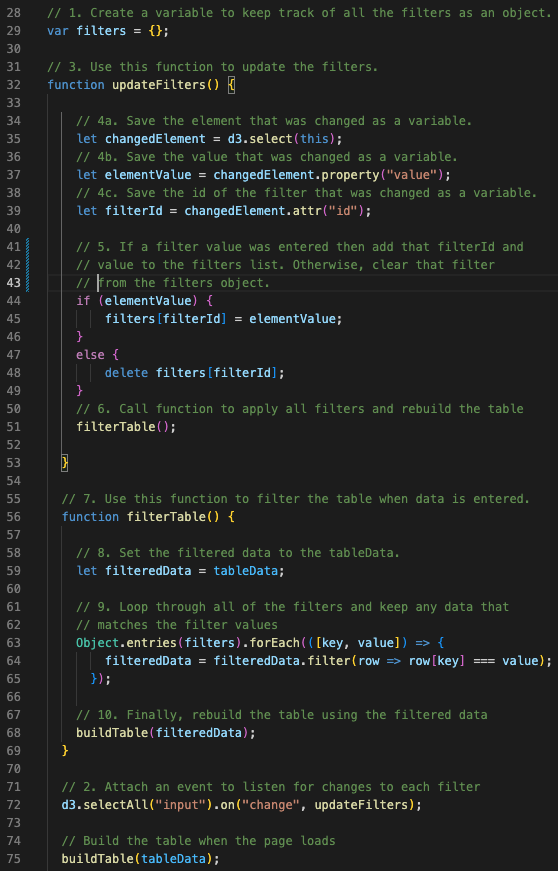
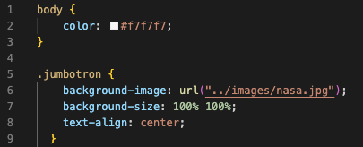
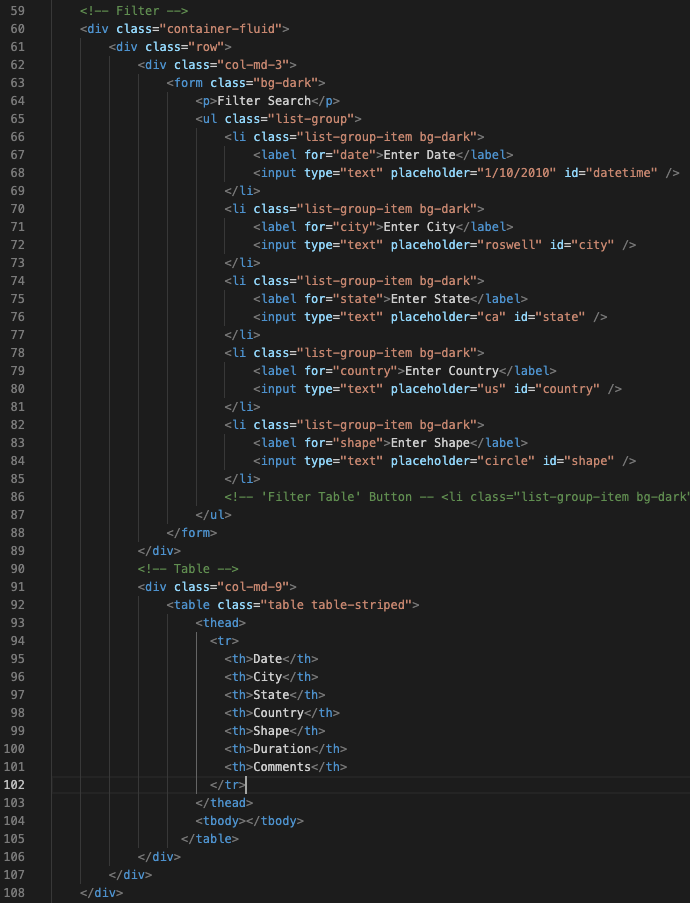
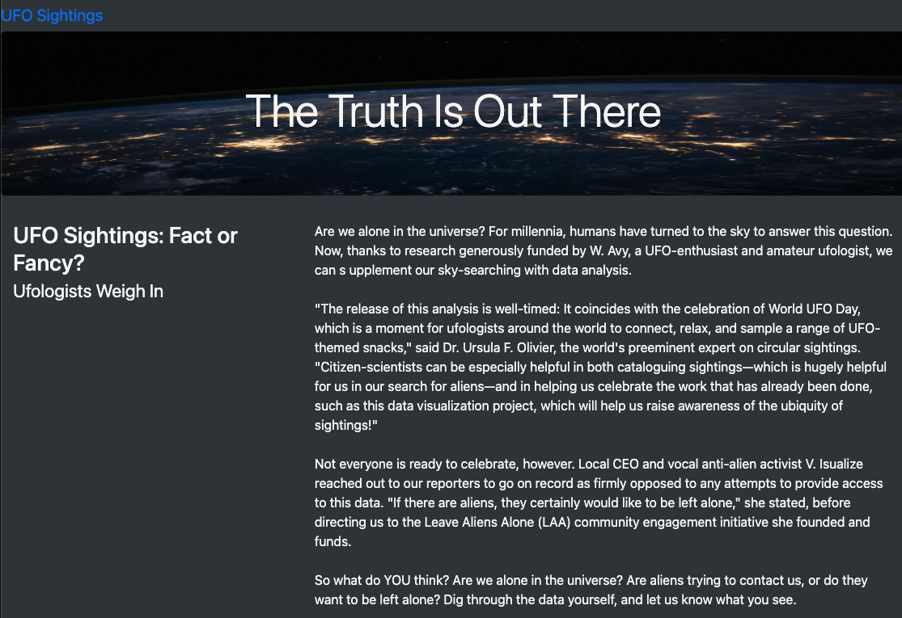
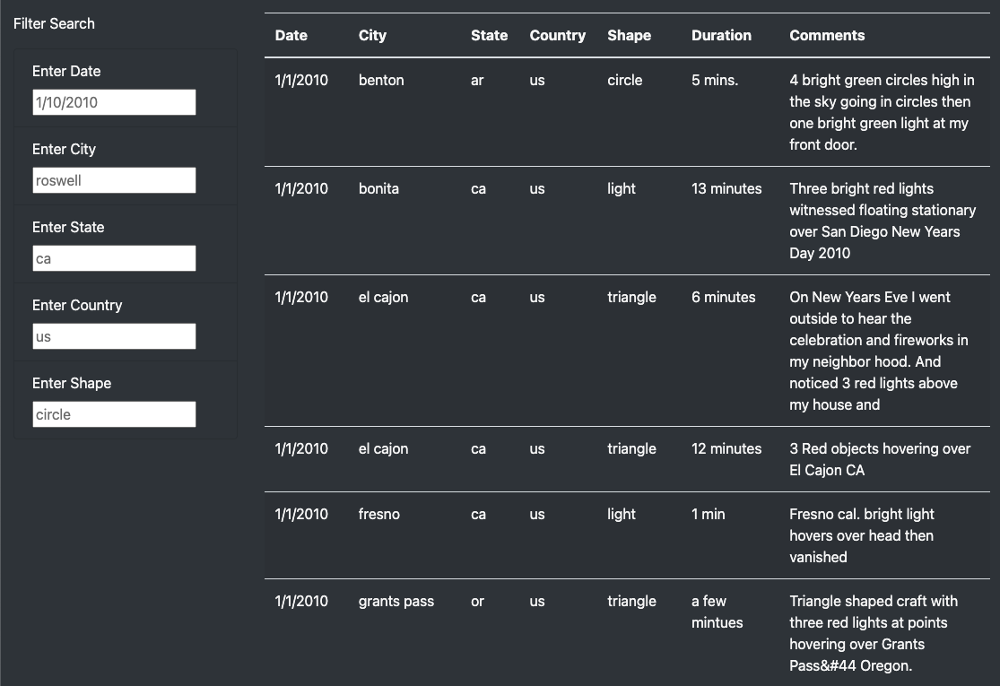

# UFO-s

## Overview

In this project I was tasked with creating a way to share some UFO sightings data. In order to  properly display the information I created a dynamic website. On the site there is a table and filtering tools to search through the sightings data. 
 
### Resources

- Software:
    - Visual Studio Code (version: 1.76.2)
    - Google Chrome 
- Languages: JavaScript, CSS, HTML
- Data Source: [static/js/data.js]( static/js/data.js)

## Results & Visualizations

### Generated Code 
#### JavaScript Code [static/js/app.js]( static/js/app.js)

#### CSS Code [static/css/style.css]( static/css/style.css)

#### HTML Code [index.html]( index.html)

### Webpage Description 

[images/ufo_site.png](images/ufo_site.png)

[images/filter_table.png](images/filter_table.png)

### Summary of Findings 
